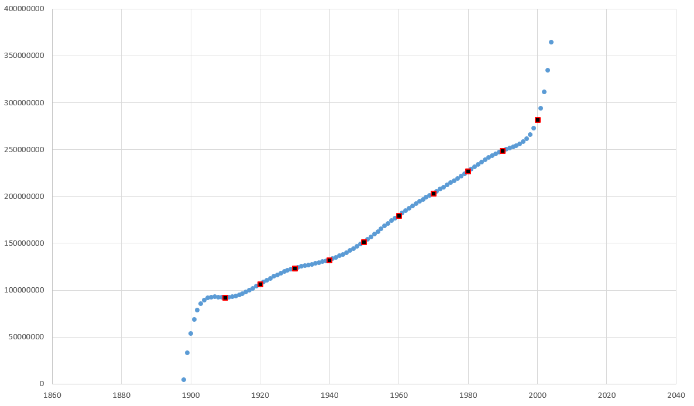
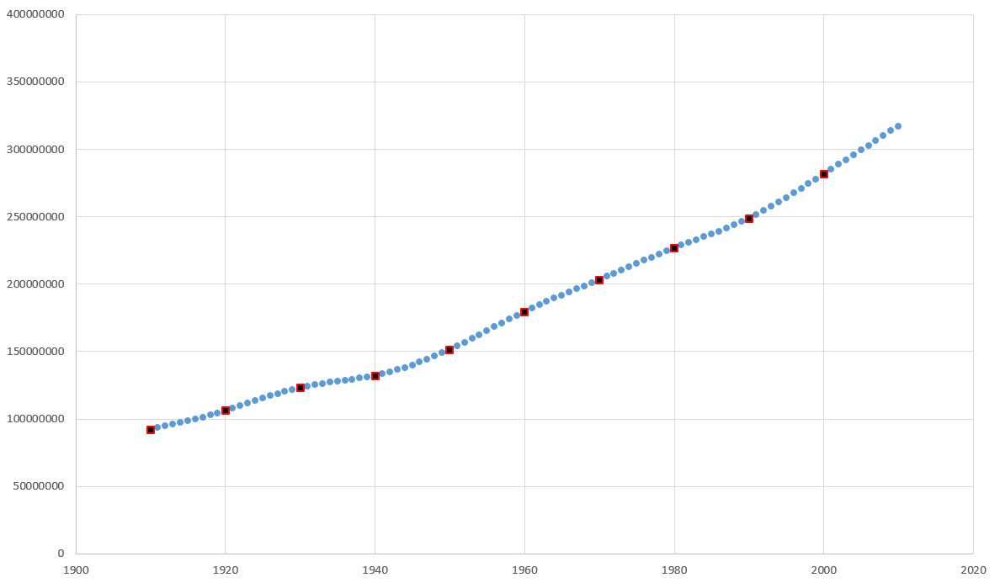
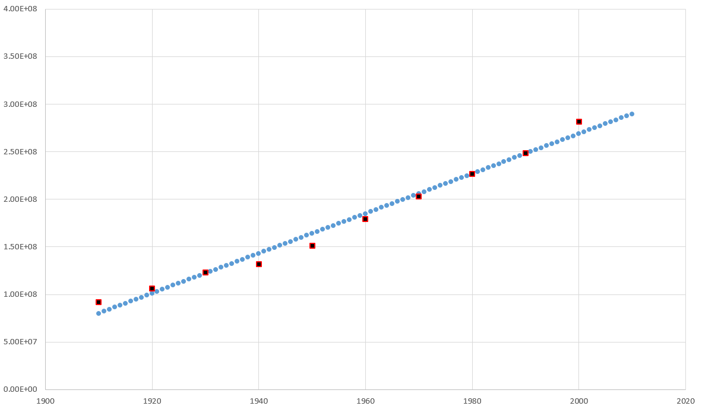

# ЛАБА 4 ПО ВЫЧМАТАМ
## Завязка:

Были даны следующие данные:

| *Year* | *Population* |
|--------|--------------|
| 1910   | 92 228 496   |
| 1920   | 106 021 537  |
| 1930   | 123 202 624  |
| 1940   | 132 164 569  |
| 1950   | 151 325 798  |
| 1960   | 179 323 175  |
| 1970   | 203 211 926  |
| 1980   | 226 545 805  |
| 1990   | 248 709 873  |
| 2000   | 281 421 906  |

Нужно было все это апроксимировать, а после экстраполировать на 2010 год

## Интерполяция по Ньютону
Построил интерполянт в форме Ньютона, его график представлен ниже:

Экстраполированное население США в 2010 получилось равным 827 906 509 чел.
## Интерполяция кубическимим сплайнами
Использовав алгоритм с Википедии, получил следующий график:

Здесь уже экстраполированное значение равно 317 062 287 чел.
## МНК для прямой
А что если апроксимировать прямой? С помощью МНК я реализовал это в жизнь:

Значение в 2010 году получилось равным 289 729 000 чел.
## Заключение
Из всех реализованных способ наиболее точным получился метод интерполяции слайнами, поскольку реальное население США в 2010 составляло 309 330 000